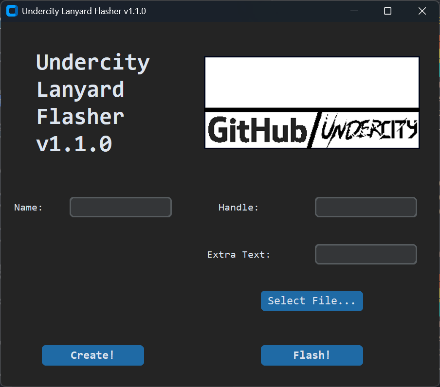
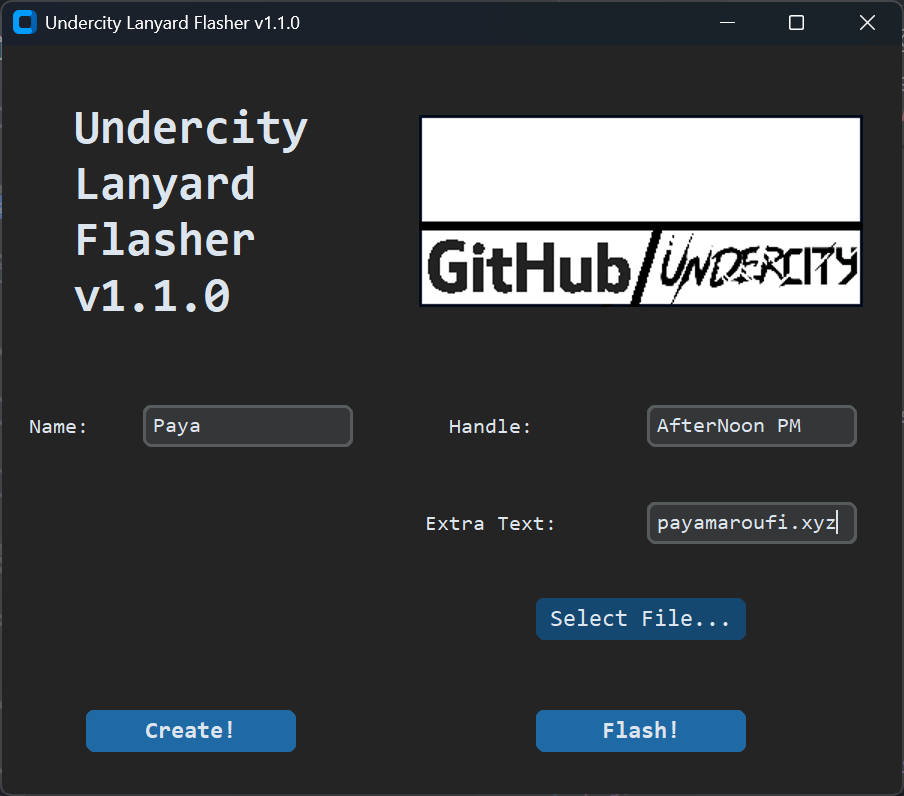
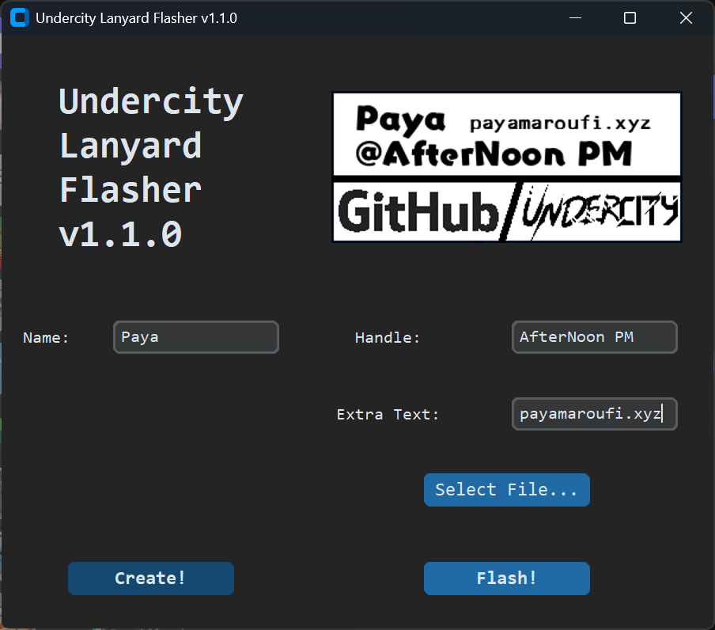
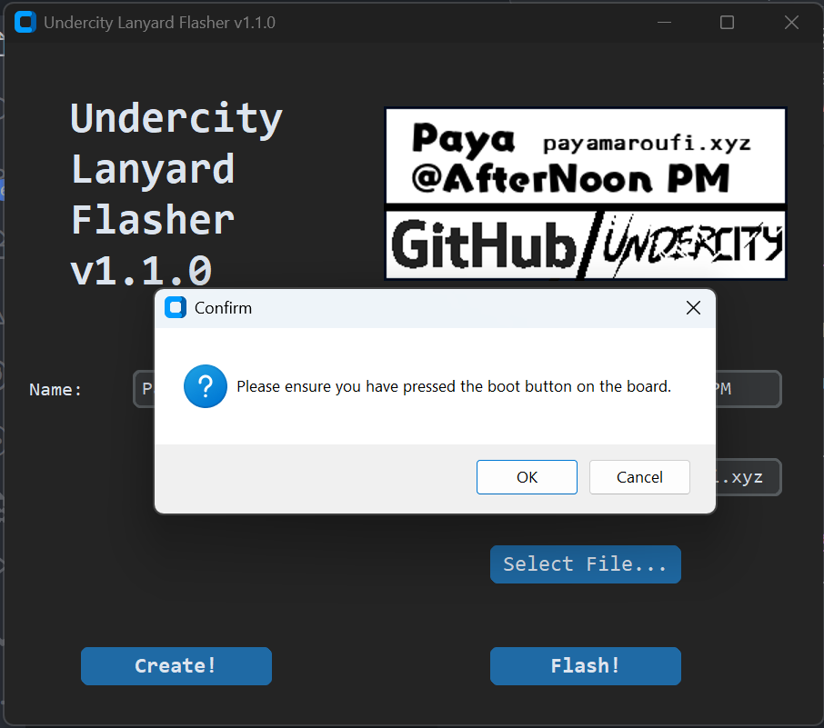

# Undercity eink lanyard WITH GUI

[](https://hackatime.hackclub.com)
[](https://python-poetry.org/)

[](https://github.com/Tinkering-Townsperson/undercity-lanyard)


Ok before we go ahead, I just want to credit [@vracton](https://github.com/vracton/undercity-lanyard), [@JeffreyWangDev](https://github.com/JeffreyWangDev/undercity-lanyard), [@phthallo](https://github.com/phthallo/undercity-lanyard), and especially [@espcaa](https://github.com/espcaa/undercity-lanyard) for creating most of the codebase. I only restructured some things and gave it a somewhat-janky-but-usable GUI.

## Setup

1. Install a venv

```sh
python -m venv .venv
```

2. Activate the venv

Windows:

```cmd
.\.venv\Scripts\activate
```

Mac/Linux:

```sh
chmod +x ./.venv/bin/activate
source ./.venv/bin/activate
```

3. Run

```sh
pip install .[gui]
```

## Usage (Console mode)

1. In the venv, run

```sh
undercity_lanyard_console
```

2. Follow the instructions and answer the prompts
3. **DONE!** ::

## Usage (GUI mode)

1. In the venv, run

```sh
undercity_lanyard_gui
```



2. Enter information in the entry boxes



3. Click `Create!` and watch the preview update



4. Click `Flash!` and follow the message boxes.




5. IT WORKS YAY :exploding_head:


